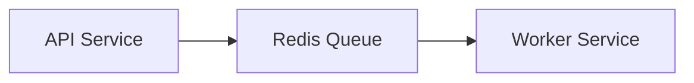

# TranscodeFlow

A distributed video transcoding service built in Go that processes video files using Jellyfin-FFmpeg.

## Features

- Redis-based job queue
- Concurrent file processing
- Telemetry and logging
- Docker containerization
- Configurable batch processing

## Architecture



## Prerequisites

- Go 1.23.6 or higher
- Redis 7.x
- Jellyfin-FFmpeg
- Docker and Docker Compose
- Intel ARC GPU

## Installation

```bash
git clone https://github.com/yourusername/transcodeflow.git
cd transcodeflow
go mod download
```

Submit a transcoding job:

```bash
curl -X POST http://localhost:8080/api/v1/jobs \
  -H "Content-Type: application/json" \
  -d '{
    "input_path": "/path/to/videos",
    "output_path": "/path/to/output",
    "container_type": "mp4",
    "codec": "av1"
  }'
```

## Development

Build the services:

```bash
cd src/transcode_handler
go build -o transcode_handler main.go
```

Run tests:

```bash
cd src/transcode_handler
go test ../. -v
```


## Contributing

1. Fork the repository
2. Create your feature branch (`git checkout -b feature/amazing-feature`)
3. Commit your changes (`git commit -m 'Add amazing feature'`)
4. Push to the branch (`git push origin feature/amazing-feature`)
5. Open a Pull Request

## License

This project is licensed under the MIT License - see the LICENSE file for details.

## Acknowledgments

- [FFmpeg](https://ffmpeg.org/) for video processing
- [Jellyfin-FFmpeg](https://github.com/jellyfin/jellyfin-ffmpeg) for better driver support out of box
- [Redis](https://redis.io/) for job queue management
- [Go](https://golang.org/) for the programming language

## Contact

Project Link: [https://github.com/yourusername/transcodeflow](https://github.com/yourusername/transcodeflow)
