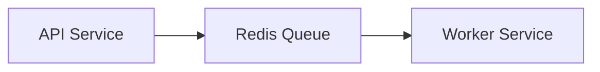

# TranscodeFlow

[](https://github.com/camcast3/transcodeflow/actions/workflows/transcodeflow_build_official.yaml)

[](https://opensource.org/licenses/MIT)

A distributed video transcoding service built in Go that processes video files using Jellyfin-FFmpeg.

## Features

- Redis-based job queue
- Concurrent file processing
- Telemetry and logging
- Docker containerization
- Configurable batch processing

## Architecture



## Prerequisites

- Go 1.23.6 or higher
- Redis 7.x
- Jellyfin-FFmpeg
- Docker and Docker Compose
- Intel ARC GPU

## Installation

```bash
git clone https://github.com/yourusername/transcodeflow.git
cd transcodeflow
go mod download
```

Submit a transcoding job:

```bash
curl -X POST http://localhost:8082/submit \
  -H "Content-Type: application/json" \
  -d '{
    "input_file_path": "/path/to/input.mp4",
    "output_file_path": "/path/to/output.mp4",
    "output_container_type": "mp4",
    "dry_run": "true"
  }'
```

For advanced usage with custom encoding arguments:
```bash
curl -X POST http://localhost:8082/submit \
  -H "Content-Type: application/json" \
  -d '{
    "input_file_path": "/path/to/input.mkv",
    "output_file_path": "/path/to/output.mp4",
    "output_container_type": "mp4",
    "global_arguments": "-hide_banner -y",
    "output_arguments": "-c:v libx264 -crf 23"
  }'
```

For simple options (novice users):

```bash
curl -X POST http://localhost:8082/submit \
  -H "Content-Type: application/json" \
  -d '{
    "input_file_path": "/path/to/input.mp4",
    "output_file_path": "/path/to/output.mp4",
    "output_container_type": "mp4",
    "simple_options": {
      "quality_preset": "quality",
      "resolution": "1080p",
      "use_hardware_acceleration": true,
      "audio_quality": "high"
    }
  }'
```

## Development

Build the services:

```bash
go build -o transcodeflow cmd/transcodeflow/main.go
```

Run tests:

```bash
go test ./internal/...
go test ./cmd/trancodeflow/integration_test.go
```


## Contributing

1. Fork the repository
2. Create your feature branch (`git checkout -b feature/amazing-feature`)
3. Commit your changes (`git commit -m 'Add amazing feature'`)
4. Push to the branch (`git push origin feature/amazing-feature`)
5. Open a Pull Request

## License

This project is licensed under the MIT License - see the LICENSE file for details.

## Acknowledgments

- [FFmpeg](https://ffmpeg.org/) for video processing
- [Jellyfin-FFmpeg](https://github.com/jellyfin/jellyfin-ffmpeg) for better driver support out of box
- [Redis](https://redis.io/) for job queue management
- [Go](https://golang.org/) for the programming language

## Contact

Project Link: [https://github.com/camcast3/transcodeflow](https://github.com/yourusername/transcodeflow)
